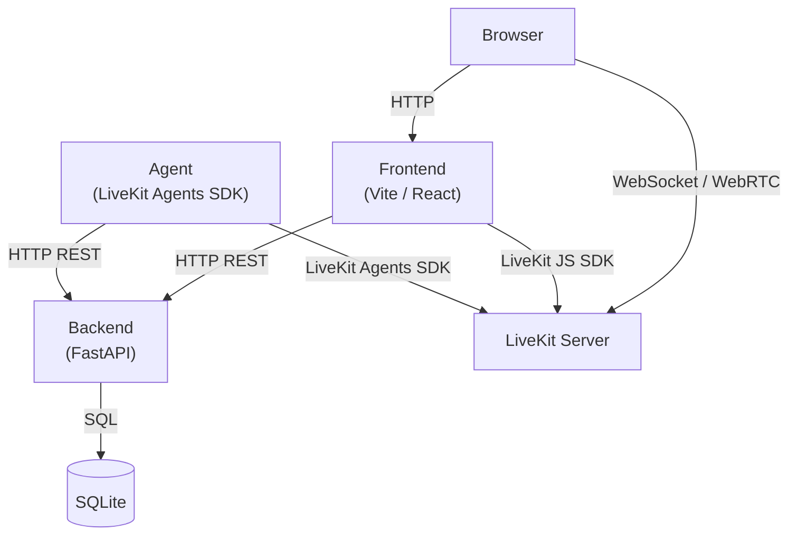
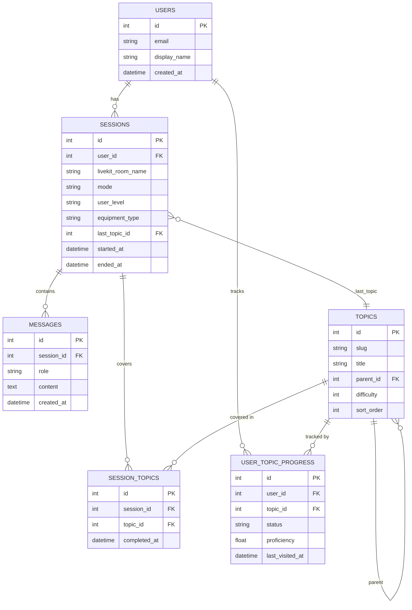

# photograph-tutor-mvp

Real-time voice AI photography tutor: monorepo with Python backend, React frontend, and LiveKit for voice sessions.

## System Requirements

| Dependency | Minimum Version |
|------------|-----------------|
| Docker | 24.0 |
| Docker Compose | 2.20 |

## Environment Setup

1. Copy the example env file:

   ```bash
   cp .env.example .env
   ```

2. Open `.env` and fill in the values below (**only OPENAI_API_KEY need to be set if it's ran in docker**):

| Variable | Required | Default | Description |
|----------|----------|---------|-------------|
| `LIVEKIT_URL` | Optional | `ws://localhost:7880` | LiveKit server WebSocket URL |
| `LIVEKIT_API_KEY` | Optional | `devkey` | LiveKit API key (matches `livekit.yaml`) |
| `LIVEKIT_API_SECRET` | Optional | `devsecret` | LiveKit API secret |
| `OPENAI_API_KEY` | **Required** | — | OpenAI key; required for AI voice features |
| `DATABASE_URL` | Optional | `sqlite+aiosqlite:///./db/local.db` | SQLAlchemy connection string |
| `VITE_BACKEND_URL` | Optional | `http://localhost:8000` | Backend URL used by the browser |

3. Start all services:

   ```bash
   make up
   ```
4. open in browser [http://localhost:5173](http://localhost:5173)

## Service URLs

| Service | URL | Notes |
|---------|-----|-------|
| Frontend | http://localhost:5173 | React dev server (Vite) |
| Backend | http://localhost:8000 | FastAPI |
| Backend health | http://localhost:8000/health | Returns `{"status":"ok"}` |
| LiveKit | ws://localhost:7880 | WebSocket endpoint |

## Architecture Overview

Five services run locally via Docker Compose. The browser connects to the React frontend, which communicates with the FastAPI backend over HTTP and with LiveKit over WebSocket/WebRTC. A separate LiveKit Agent process joins each room to handle AI voice processing.



## Database Schema

The six critical tables. Foreign keys use crow's-foot notation (one-to-many: `||--o{`, one-to-one: `||--||`).



## Common Commands

```bash
make up       # Start all services (detached)
make down     # Stop all services
make logs     # Tail logs from all services
make build    # Rebuild Docker images

# Backend only
cd backend && uv sync                                    # Install Python deps locally
cd backend && uv run uvicorn app.main:app --reload       # Run without Docker

# Frontend only
cd frontend && npm install    # Install Node deps
cd frontend && npm run dev    # Run without Docker
```

## Directory Layout

```
/
├── backend/          # Python FastAPI app (uv, SQLAlchemy, LiveKit Agents SDK)
│   ├── app/          # Application package
│   │   ├── api/      # Route handlers
│   │   ├── main.py   # FastAPI entry point
│   │   ├── settings.py
│   │   └── database.py
│   ├── agent.py      # LiveKit agent entry point
│   ├── Dockerfile
│   └── pyproject.toml
├── frontend/         # React + Vite app (LiveKit JS SDK)
│   ├── src/
│   │   ├── components/
│   │   └── App.tsx
│   ├── Dockerfile
│   └── package.json
├── docker-compose.yml
├── livekit.yaml      # LiveKit dev server config
├── .env.example      # Copy to .env and fill in values
├── Makefile
└── CLAUDE.md
```

## Key Design Decisions & Trade Offs
### Separate the Agent component as independent deployment.
* cons: need to maintain the additional deployment.
* pros: decouple the logic from the main app. If the agent crashes, the FastAPI server keeps running (and vice versa). Makeing it possible to only scale out the agent capability, to support more chat rooms.
### Message Polling vs Push (current is polling every 2s)
* cons: Wasteful at scale: 1,000 concurrent sessions = 500 requests/second; Up to 2 seconds of visible lag between the agent speaking and the transcript updating
* pros: 
  - Dead simple: one React Query config line
  - Works everywhere, no extra infrastructure
  - Resilient: if a message is missed, the next poll catches it


## Scaling Considerations

  * **Horizontal scaling**: The backend and agent services are stateless and can each scale out independently behind a load balancer. 

  * **Database**: Replace SQLite with PostgreSQL/MySQL and introduce read replicas to separate read and write traffic.

  * **Caching**: Add a Redis layer in front of the database for frequently read data (session context, topic lists). This reduces DB load and cuts agent startup latency.

  * **Conversation history**: The current approach loads the last 50 messages raw on every session join. At scale, introduce one of: (1) summarization, compress older turns into a single context block, or (2) RAG, embed and index message history, retrieve only semantically relevant turns per user input.

  * **Transcript delivery**: Replace the 2-second polling interval with push-based delivery via the LiveKit data channel, so the frontend only receives data when something actually changes.

  * **Pagination** — Add `limit`/`offset` or cursor-based pagination to `GET /api/sessions/{id}/messages` to avoid returning unbounded result sets as sessions grow long.
